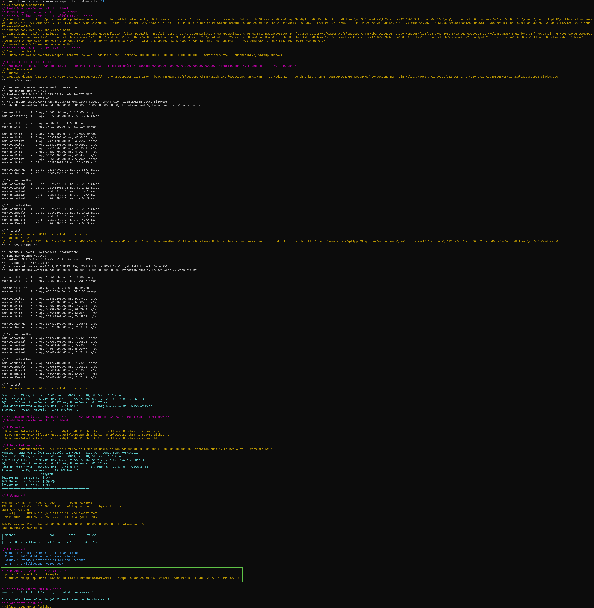
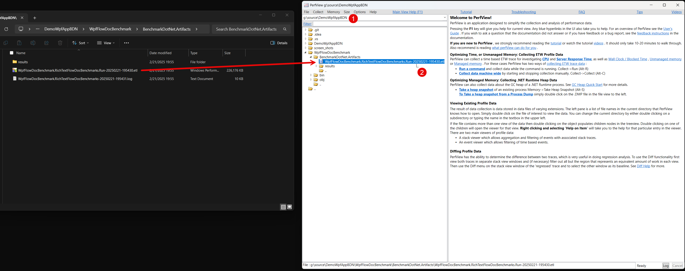
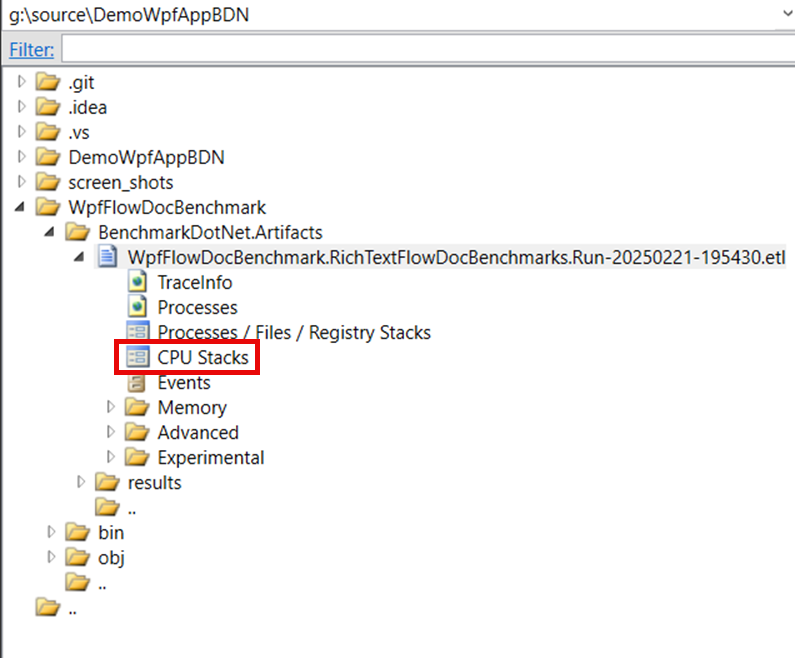
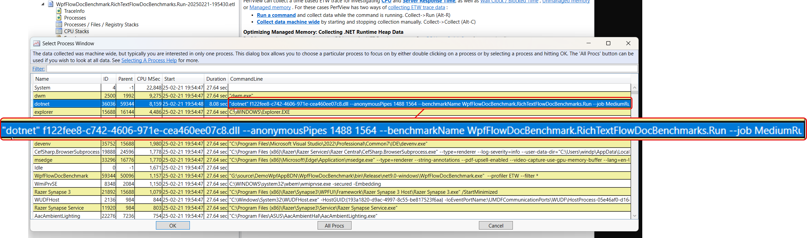
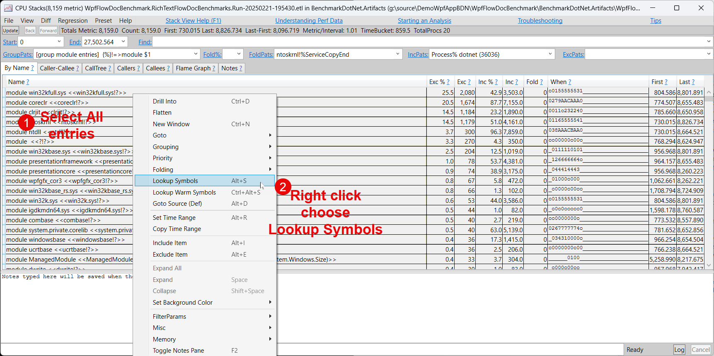
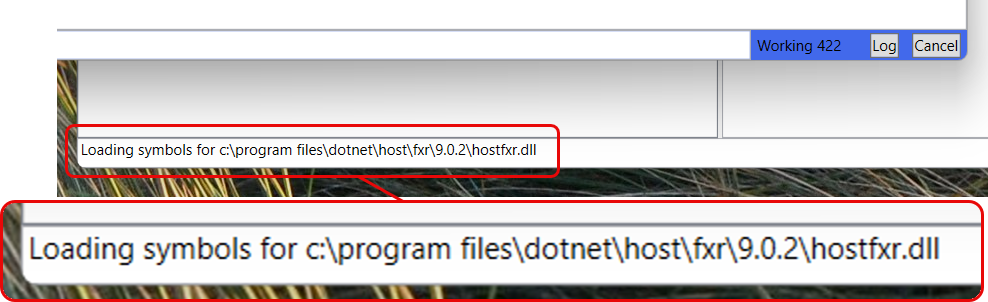
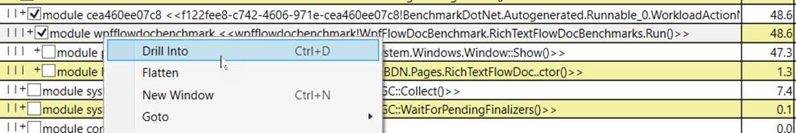
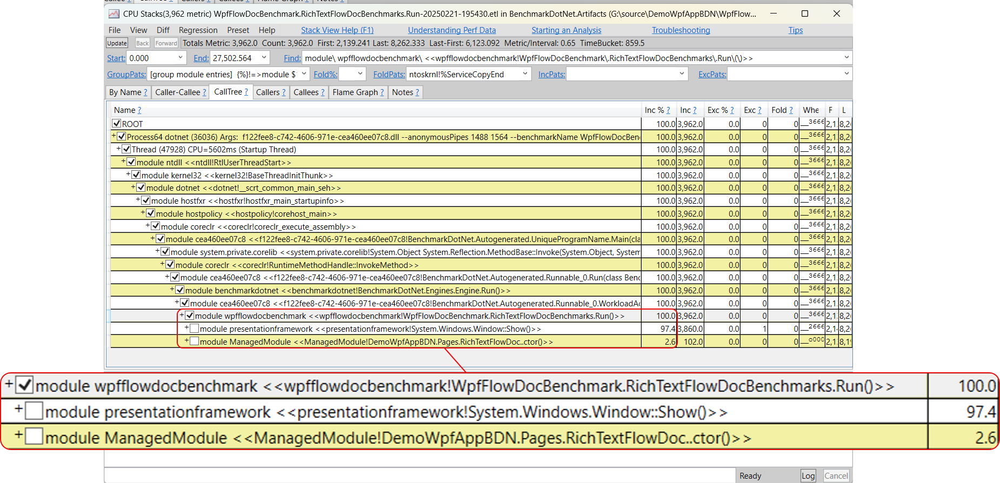
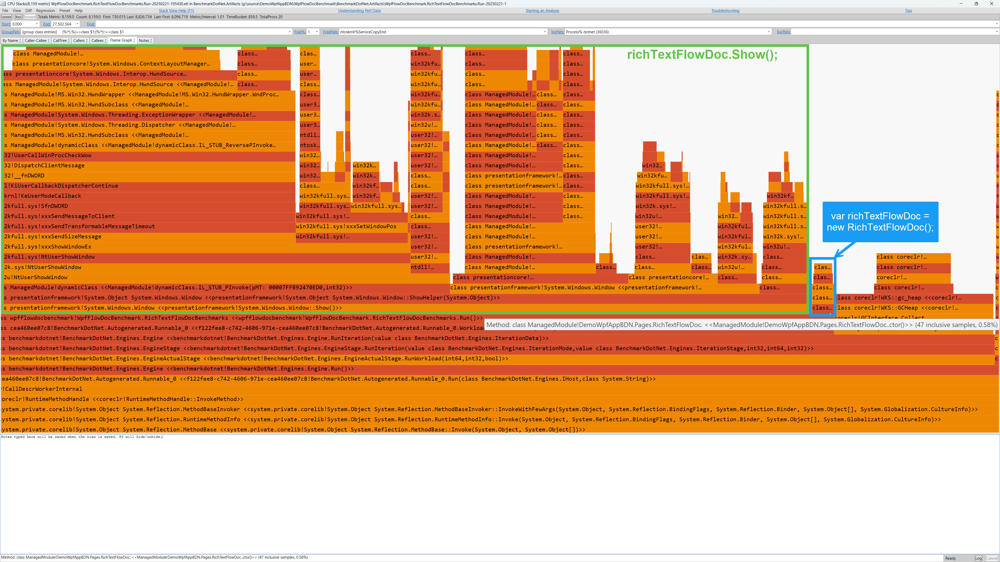

# How to generate Flame Graph of benchmarks 

To use the [ETW Profiler feature of BenchmarkDotNet](https://benchmarkdotnet.org/articles/features/etwprofiler.html) to generate Flame Graphs, you need to install the [PerfView](https://github.com/microsoft/perfview) and with Administrator privileges on the operating Windows 10/11 environment.  
(On Windows 11 you can use [Sudo for Windows](https://learn.microsoft.com/windows/sudo/), on Windows 10 you can install [gsudo](https://github.com/gerardog/gsudo))

And you may need to [config PerfView's resolve symbol feature](https://learn.microsoft.com/en-us/shows/perfview-tutorial/3-resolving-symbols) to use [Microsoft public symbol server](https://learn.microsoft.com/windows-hardware/drivers/debugger/symbol-path#using-a-symbol-server-srv) on PerfView to download the symbols for the .NET runtime libraries.)

1. Run the benchmark with the ETW Profiler enabled and with Administrator privileges:
   
    ```
    sudo dotnet run --project .\WpfFlowDocBenchmark\WpfFlowDocBenchmark.csproj -c Release -- --profiler ETW --filter '*'
    ```
   
2. After it finishes, you will see additional ***.etl** file in the `BenchmarkDotNet.Artifacts` folder.  
   
3. Open the ***.etl** file with PerfView:  
   
4. Double Click on the **CPU Stacks** button:  
   
5. Select the process that looks mostly like the benchmark process:  
   
6. On popup window, first select all entries in middle list, then right click open context menu and choose "Lookup Symbols"   
     
   Waiting for PerfView to download symbols from Microsoft public symbol server:  
   
7. After symbols are resolved, select "**CallTree**" tab, use the top right ***Find:*** input box and type `Run\(\)` (This input field accepts *Regular Expression* string) and press Enter to find the benchmark method quickly, and you can right click on the entry and choose "Drill Into" to focus only on the benchmark method:  
     
     
8. Also you can see the Flame Graph of the benchmark by click the second right tab "Flame Graph":  
     
   You can use the **Fold%** input box in middle top of the window, to filter out the less significant parts of the Flame Graph,  
   And select the correct entry on top left **GroupPats** input box to see invoked Class.Methods in the Flame Graph.