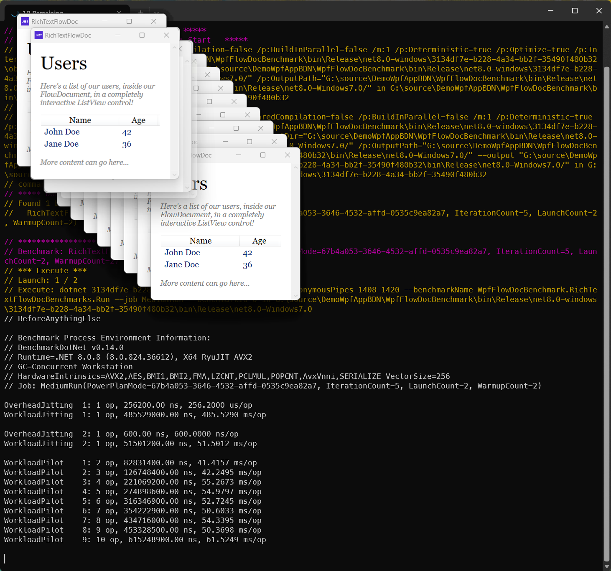

# BenchmarkDotNet WPF Demo

This is a demo project to demonstrates how to use [BenchmarkDotNet](https://benchmarkdotnet.org/) to run benchmarks for a custom Window UI part of a .NET 8.0 WPF application.

## How to run the benchmarks

Goto the **WpfFlowDocBenchmark** folder and run the following command:

```sh
dotnet run -c Release -- *
```


