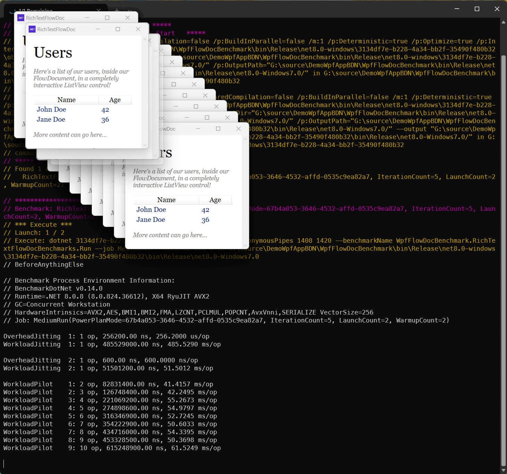

# BenchmarkDotNet WPF Demo

This is a demo project to demonstrates how to use [BenchmarkDotNet](https://benchmarkdotnet.org/) to run benchmarks for a custom Window UI part of a .NET 9.0 WPF application.

## How to run the benchmarks

### Prerequisites

- Windows 10 or later (required for the WPF application running)
- [.NET 9.0 SDK](https://dotnet.microsoft.com/download/dotnet/9.0)

### Run the benchmark

On Windows, in the **WpfFlowDocBenchmark** folder run the following command:

```sh
dotnet run -c Release -- *
```




## Generate Flame Graph

See [Generate_FlameGraph.md](Generate_FlameGraph.md) for instructions on how to generate Flame Graphs of benchmark runs.